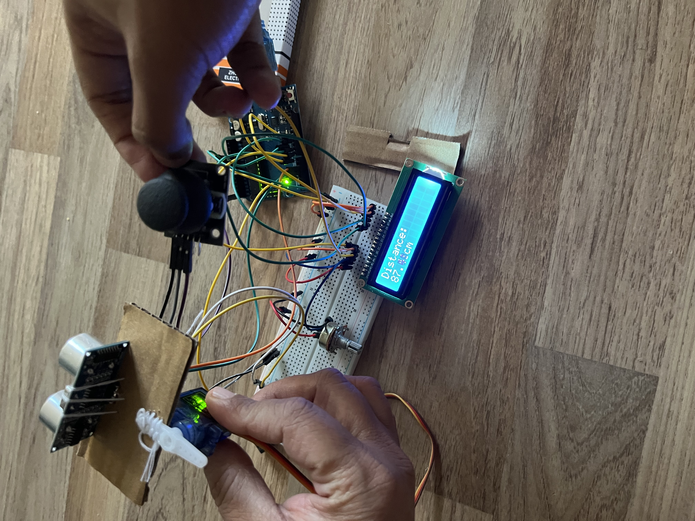

# Joystick-Controlled Servo with Ultrasonic Distance Display

An Arduino project that combines a joystick-controlled servo with an HC-SR04 ultrasonic distance sensor, displaying live distance readings on a 16x2 LCD.

[View project demo](https://drive.google.com/file/d/1Mf_taLbBkdDg1_vxRLhGcJaJ8XILAfj_/view?usp=sharing)



## Features

- Control a servo's position (0°–90°) using a joystick's X-axis
- Measure distance in real time using an HC-SR04 ultrasonic sensor
- Display distance readings on a 16x2 character LCD
- Print distance readings to Serial Monitor for debugging

## Hardware Required

| Component | Quantity |
|---|---|
| Arduino (Uno or compatible) | 1 |
| SG90 (or similar) servo motor | 1 |
| Analog joystick module | 1 |
| HC-SR04 ultrasonic distance sensor | 1 |
| 16x2 LCD (HD44780-compatible) | 1 |
| Potentiometer (for LCD contrast, optional) | 1 |
| Breadboard + jumper wires | — |

## Pin Connections

### Servo
| Servo Pin | Arduino Pin |
|---|---|
| Signal | 3 |
| VCC | 5V |
| GND | GND |

### Joystick
| Joystick Pin | Arduino Pin |
|---|---|
| X-axis (VRx) | A5 |
| VCC | 5V |
| GND | GND |

### HC-SR04 Ultrasonic Sensor
| Sensor Pin | Arduino Pin |
|---|---|
| Trig | 4 |
| Echo | 5 |
| VCC | 5V |
| GND | GND |

### 16x2 LCD
| LCD Pin | Arduino Pin |
|---|---|
| RS | 7 |
| EN | 8 |
| D4 | 9 |
| D5 | 10 |
| D6 | 11 |
| D7 | 12 |

> **Note:** LCD VSS, RW, and LED- go to GND; VDD and LED+ go to 5V. Use a potentiometer between 5V and GND, with the wiper on the LCD's V0 pin, to adjust contrast.

## Libraries Used

- [`Servo.h`](https://www.arduino.cc/reference/en/libraries/servo/) — built into the Arduino IDE
- [`LiquidCrystal.h`](https://www.arduino.cc/reference/en/libraries/liquidcrystal/) — built into the Arduino IDE

No external library installation is required.

## How It Works

### Servo control
The joystick's X-axis reading (0–1023) is linearly scaled to a servo angle between 0° and 90°:

```cpp
servoPos = (90./513.)*xVal;
myServo.write(servoPos);
```

Moving the joystick fully in one direction sweeps the servo across its full range; the servo tracks the joystick position directly (proportional control, not speed control).

### Distance measurement
The HC-SR04 is triggered with a 10µs HIGH pulse on `trigPin`. The sensor emits an ultrasonic pulse and drives `echoPin` HIGH for the duration the pulse takes to return. That duration is converted to distance in centimeters using the speed of sound:

```cpp
distance = (duration * 0.034) / 2;
```

The division by 2 accounts for the pulse traveling to the object and back (round trip).

### Display
Readings are printed to the Serial Monitor (9600 baud) and shown on the LCD's second row, right-padded with spaces via the `pad()` helper function to fully overwrite any leftover characters from the previous reading.

## Usage

1. Wire the components as described above.
2. Open the sketch in the Arduino IDE and select your board/port.
3. Upload the sketch.
4. Open the Serial Monitor (9600 baud) to view raw distance readings.
5. Move the joystick to sweep the servo; point the ultrasonic sensor at an object to see the distance update on the LCD.

## Known Limitations / Possible Improvements

- **Servo range is capped at 0°–90°.** The scaling formula `(90./513.)*xVal` only uses half the joystick's range effectively — pushing the joystick fully one direction (xVal near 1023) would compute past 90°, but since xVal only goes up to ~1023 and the divisor is 513, the max output is ~180. Adjust the formula if a different range is desired.
- **`delay(500)` blocks the whole loop**, including servo updates. This makes the servo feel less responsive since it only updates twice per second. Lowering the delay (e.g., to ~60ms) improves responsiveness while still giving the HC-SR04 enough time between pings to avoid echo interference; for fully independent update rates, use `millis()`-based timing instead of `delay()`.
- **No timeout on `pulseIn()`.** If no echo returns (object out of range), `pulseIn()` will wait for its default timeout (up to 1 second) before returning 0. Adding a timeout argument, e.g. `pulseIn(echoPin, HIGH, 30000)`, bounds the wait to 30ms and avoids stalling the loop.
- **No out-of-range handling.** A `duration` of 0 (timeout) will compute `distance = 0`, which looks like a valid reading. Consider displaying "Out of range" when `duration == 0`.

## License

Free to use and modify for personal or educational projects.
